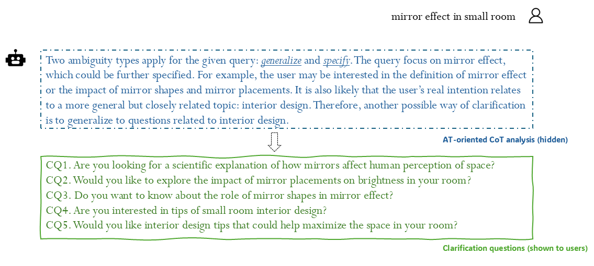

## Clarifying Ambiguities: on the Role of Ambiguity Types in Prompting Methods for Clarification Generation


Implementation for paper "Clarifying Ambiguities: on the Role of Ambiguity Types in Prompting Methods for Clarification Generation" (To appear at SIGIR 2025). 


### Setup
Install from source:
```
git clone https://github.com/anfutang/ClarifyingAmbiguities
cd ClarifyingAmbiguities
pip install -r requirements.txt
```

### Quick Start
Use the following script to reproduce the CG results on ClariQ (configure your GPU settings in exp.sh):
```
bash scripts/exp.sh clariq 1 cg generation
```
